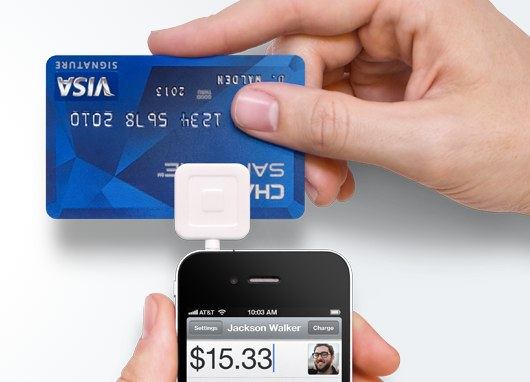
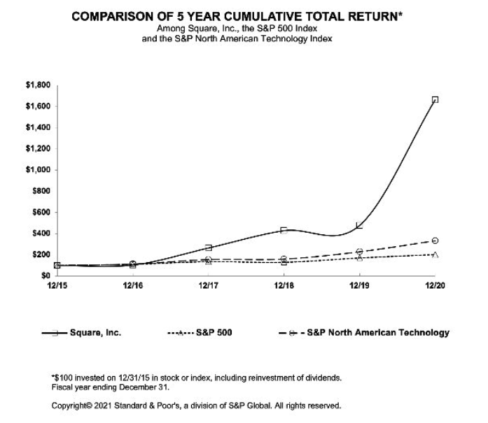
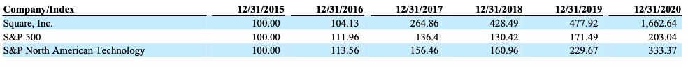

## Overview and Origin

* Square, Inc. is a technology company based in San Francisco, California. The company was founded in 2009 by Jack Dorsey and Jim Mckelvey. It provids financial services and digital payments solution to small businesses and enterprises. The original idea for the company came about when Jim Mckelvey was unable to complete a sale of his products because he could not accept credit cards. The company raised its funds from venture capitalists. Early investors include Twitter co-founder Biz Stone, former Yahoo! CEO Marissa, and Napster founder Shawn Fanning. The following is a timeline of Square's pre-IPO funding. The company had its IPO with an initial valuation of $2.9 billion on November 19th, 2015. The company changed its name to Blck on December 2021.

 
 

| Round | Date | Amount |
| :----: | :----: | :------: |
| Series A | November,2009 | $10,000,000 |
| Series B | January,2011 | $27,500,000 |
| Series C | June, 2011 | $100,000,000 |
| Series C | December, 2011 | $3,000,000 |
| Series D | September, 2012 | $200,000,000 |
| Debt Financing | April, 2014 | $100,000,000 |
| Series E | October, 2014 | $150,000,000 |

 

## Business Activities:
* Since 2009, Square has provides digital payments solutions to small business. The first product of Square was Square Reader that accepts creadit card payments by connecting to mobile device connected to audio jack of mobile devices. 

* The company also has created point-of-sale saoftware to enable small businesses accept card payments and assited them by providing cloud based analytics. The payment processing solutions and business analytics makes Square more competitive in the industry.

* In 2013, Square launched Cash App under the name "Square Cash". It allows users totransfer money to one another usingg a mobile phone app. In 2015, the company introduced Square Cash for business. In 2018, the app added support to allow users to trade bitcoin. In 2019, the app added support for stock trading in the US. The service had 70 million annual transacting users and generated $1.8 billion in gross profit in 2021.

 

## Landscape:
* Square is primarily in the payment processing industry. The pandemic and business and consumer shift dollars from cash to digital payment methods accelerated the industry digitization by two to three years. Moreover, online retail sales also surged to a record-breaking 14.4% of total US retail due to increase of spending on smartphone. In 2021, the industry will continue to achieve high level of growth.

* PayPal, Stripe and Clover are the major companies in the payment processing industry.

## Results
* The company posted a strong result in 2020. Compared to the result of 2019, the annual revenue increased 101.50% (from $4.7 billion to $9.5 billion) and EBIT also increased 9.28 times (from $27 million to $213 million).
* The company was able to add new sellers efficiently and help them grow their business. As a result, in 2020, the company processed $103.7 billion of Seller Gross Payment Volume (GPV) generated by more than 2 billion card payments from 405 million payment cards.
* The 5 year cumulative total return of Square shown that its performance is 5 times higher compared to the average of same sector index (S&P North American Technology).

## Recommendations
* The cryptocurrency industry has grown dramatically in recent years. There are still a lot of potential for companies to make significantly impact in the industry. Square has developed products and services in payment processing industry since 2009 and enhanced its brand power. It has the potential ability to create new services and products to succeed in the industry. Furthermore, the company has added and provide services for cryptocurrency into its Cash App and also purchased $50 million of bitcoins in 2020 and $170 million of bitcoins in 2021. The crypocurrency industry may be a new direction for the company to extend its business.

## Reference
* [Square (financial services company), Wikipedia](https://en.wikipedia.org/wiki/Square_(financial_services_company))

* [Funding information of Square, Startup Ranking](https://www.startupranking.com/startup/square/funding-rounds)

* [Square Stock History: A Complete Timeline, The Motley Fool](https://www.fool.com/investing/2018/11/21/square-stock-history-a-complete-timeline.aspx)

* [Square products, Squareup.com](https://squareup.com/us/en)

* [Square report, USF.edu](https://www.usf.edu/business/documents/departments/finance/smif/analysis-square.pdf)

* [The payment industry's biggest trends in 2021, Insider Intelligence](https://www.insiderintelligence.com/insights/payments-ecosystem-report/)

* [Square 2021 Annual Report, Square](https://s29.q4cdn.com/628966176/files/doc_financials/2021/ar/2021-Annual-Report.pdf)